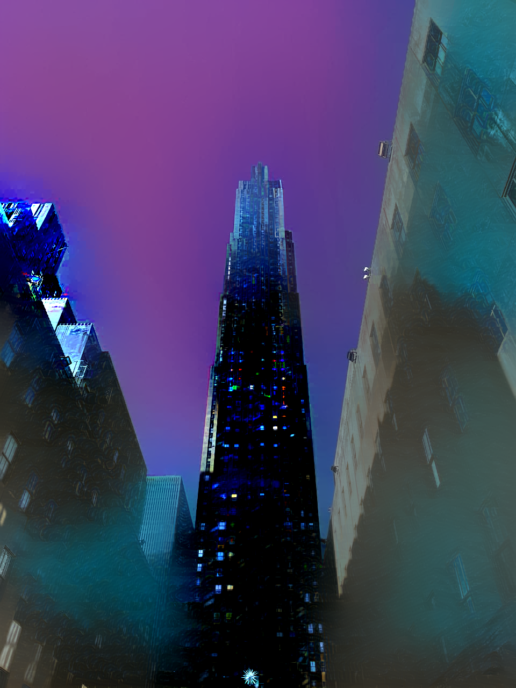

# CS523 Final Project deep-photo-styletransfer-tf

## Team member
* Junan Zhu junanz@bu.edu
* Taowen Dong taowend@bu.edu
* Yuanming Leng lengym@bu.edu

## Link to our slide

[Slide](https://docs.google.com/presentation/d/15RqGGYIHGQKBEjfSQjnWPpk1s0mu0tmQqn0VK4_QCl4/edit#slide=id.gfde27aa0a8_0_29)

## Experiment and Reproduce
**We put our experiments' results of the examples provided by the paper and our own data in the folder ./experiment_example**

## Reference Paper and Code
We fork this repo from [here](https://github.com/LouieYang/deep-photo-styletransfer-tf). This is a pure Tensorflow implementation of our project reference paper: [Deep Photo Styletransfer](https://arxiv.org/abs/1703.07511).


## Dependencies of this project
* Tensorflow = 1.15
* Numpy
* Pillow
* Scipy
* PyCUDA

## Instruction to run locally
**Please implement this repo on a Windows OS Machine. I tested the following instructions on a M1 Macbook, and it simply could not support the dependancy we need for this project. I don't have other Mac equipment to test, but it will make things easeier if you implement this on a Windows Machine.Thank you!**

### 1. Clone this repo to local

### 2. Download the VGG-19 model weights
The VGG-19 model of tensorflow is adopted from [VGG Tensorflow](https://github.com/machrisaa/tensorflow-vgg) with few modifications on the class interface. The VGG-19 model weights is stored as .npy file and could be download from [Google Drive](https://drive.google.com/file/d/0BxvKyd83BJjYY01PYi1XQjB5R0E/view?usp=sharing&resourcekey=0-Q2AewV9J7IYVNUDSnwPuCA). After downloading, copy the weight file to the **./project/vgg19** directory

### 3. Download Anaconda for setting up enviroment
If you do have Anaconda in your machine, you can proceed to the next step. If not, please download it from [here](https://www.anaconda.com/).

### 4. Setting up enviroment for the project
* Open the Anaconda Prompt
* Run the command to create env
```
conda create --name project python=3.7
```
"project" can be any name, let's use project as example in the following.
* Run the command to activate env
```
conda activate project
```
* Run the command to install tensorflow-gpu
```
conda install -c conda-forge tensorflow-gpu=1.15
```
* Run the command to install pillow
```
conda install -c conda-forge pillow
```
* Run the command to install a estimator
```
pip install tensorflow-estimator==1.15.0
```


## Usage
### Basic Usage
First cd to the clone folder. Then we then can run the model when the environment we implemented above is active, then type in the command similar to the example below in the Anaconda Prompt to run. You need to specify the path of content image, style image, content image segmentation, style image segmentation and then run the command

```
python deep_photostyle.py --content_image_path <path_to_content_image> --style_image_path <path_to_style_image> --content_seg_path <path_to_content_segmentation> --style_seg_path <path_to_style_segmentation> --style_option 2
```

*Example:*
```
python deep_photostyle.py --content_image_path ./paper_examples/input/in11.png --style_image_path ./paper_examples/style/tar11.png --content_seg_path ./paper_examples/segmentation/in11.png --style_seg_path ./paper_examples/segmentation/tar11.png --style_option 2 --serial ./results
```

### Options

`--style_option` specifies three different ways of style transferring. `--style_option 2` is the command to generate the final result directly.

`--serial` specifies the folder that you want to store the temporary result **out_iter_XXX.png**. The default value of it is `./`. We already create an empty folder to put result in it and already put `--serial ./results` in the example above. **Again, the temporary results are simply clipping the image into [0, 255] without smoothing. Since for now, the smoothing operations need pycuda and pycuda will have conflict with tensorflow when using single GPU**

### Things might happen in the process
After running, you will see x/2000 iterations in the terminal, and x will sometimes pass over 2000 and that's normal situation. The iteration will continue and the model will apply matting to the loss function after 2000 iterations. The total iteration will normally stop at 4000 and no more than 4100. If the loss doesn't change when iterating, the model will automatically stop.

### Image Segmentation
The examples provided input image, style reference image, and the segmentation image of them. Therefore, when we tried to reproduce the results by using those examples, we just simply specify the path to the segmentation. However, when we wanted to try this model with our own images, we need to generate the segmentation images by ourselves. I used [labelme](https://github.com/wkentaro/labelme) to manually do segmentaion. However, since we cannot change the label color when using labelme, most labels cannot match the label provided by the paper and the code. Therefore, when we want to generate our own works, the outcome doesn't look as good as the the outcome we generated from the examples provided. 


## Paper Examples Experiments
* Here are some comparison between our reproduce results and the results provided by the paper (from left to right: the input, the reference style, the result from paper, and our result)
* Command to reproduce the below result
```
python deep_photostyle.py --content_image_path ./paper_examples/input/in5.png --style_image_path ./paper_examples/style/tar5.png --content_seg_path ./paper_examples/segmentation/in5.png --style_seg_path ./paper_examples/segmentation/tar5.png --style_option 2 --serial ./results
```
<p align="center">
    
    
    
    
</p>

* Command to reproduce the below result
```
python deep_photostyle.py --content_image_path ./paper_examples/input/in11.png --style_image_path ./paper_examples/style/tar11.png --content_seg_path ./paper_examples/segmentation/in11.png --style_seg_path ./paper_examples/segmentation/tar11.png --style_option 2 --serial ./results
```

<p align="center">
    
    
    
    
</p>


## Own Data Experiments
* Here are some examples of our own data(from left to right: the input, the reference style, segmeation images of both, and the result)
* Command to reproduce the below result
```
python deep_photostyle.py --content_image_path ./experiment_example/owntest1_result/testinput1_json/input.png --style_image_path ./experiment_example/owntest1_result/teststyle1_json/style.png --content_seg_path ./experiment_example/owntest1_result/testinput1_json/inputseg.png --style_seg_path ./experiment_example/owntest1_result/teststyle1_json/styleseg.png --style_option 2 --serial ./results
```
<p align="center">
    
    
    
    
    
</p>

* Command to reproduce the below result
```
python deep_photostyle.py --content_image_path ./experiment_example/owntest2_result/test5input_json/input.png --style_image_path ./experiment_example/owntest2_result/test5style_json/style.png --content_seg_path ./experiment_example/owntest2_result/test5input_json/inputseg.png --style_seg_path ./experiment_example/owntest2_result/test5style_json/styleseg.png --style_option 2 --serial ./results
```

<p align="center">
    
    
    
    
    
</p>


Since our segmentation method could not work perfectly so we only generate results for specific label color which is black in our tests, and the above two tests can only tansfer the style to the sky only; therefore, I used the same input and reference as the above test, and apply the black label color to the building. We want to have a clear clue that the matting and the semantics segmentation should both work well not just on the sky, but also on other part of the input. However, in the test below, although the mapping and the segmentaion work well on the building part, the sky is weirdly purple. I believed the reason was my manual segmentation that I might include a little bit of the sky when lining the edges of buildings. From the first 100 iterations image we can tell that the purple dots were generated around the building and then spreaded out in the after images. Hence, when the matting started, things got worse.

* Command to reproduce the below result
```
python deep_photostyle.py --content_image_path ./experiment_example/otherpart_owntest2_result/reverse5input_json/rev5input.png --style_image_path ./experiment_example/otherpart_owntest2_result/reverse5style_json/rev5style.png --content_seg_path ./experiment_example/otherpart_owntest2_result/reverse5input_json/rev5inputseg.png --style_seg_path ./experiment_example/otherpart_owntest2_result/reverse5input_json/rev5styleseg.png --style_option 2 --serial ./results
```

<p align="center">
    
    
    
    
    
</p>


## Contact
Please contact me if there is any question about intructions or anything else(Junan Zhu junanz@bu.edu).
